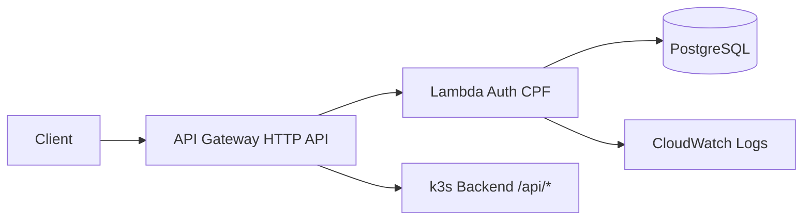

# Component Diagram

```mermaid
flowchart LR
  Client --> APIGW[API Gateway HTTP API]
  APIGW --> AuthLambda[Lambda Auth CPF]
  APIGW --> BackendProxy[k3s Backend /api/*]
  AuthLambda --> RDS[(PostgreSQL)]
  AuthLambda --> CloudWatch[CloudWatch Logs]
```
