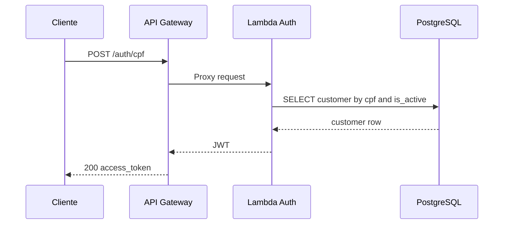

# Sequence: Auth by CPF

```mermaid
sequenceDiagram
  participant C as Cliente
  participant G as API Gateway
  participant L as Lambda Auth
  participant D as PostgreSQL

  C->>G: POST /auth/cpf
  G->>L: Proxy request
  L->>D: SELECT customer by cpf and is_active
  D-->>L: customer row
  L-->>G: JWT
  G-->>C: 200 access_token
```
